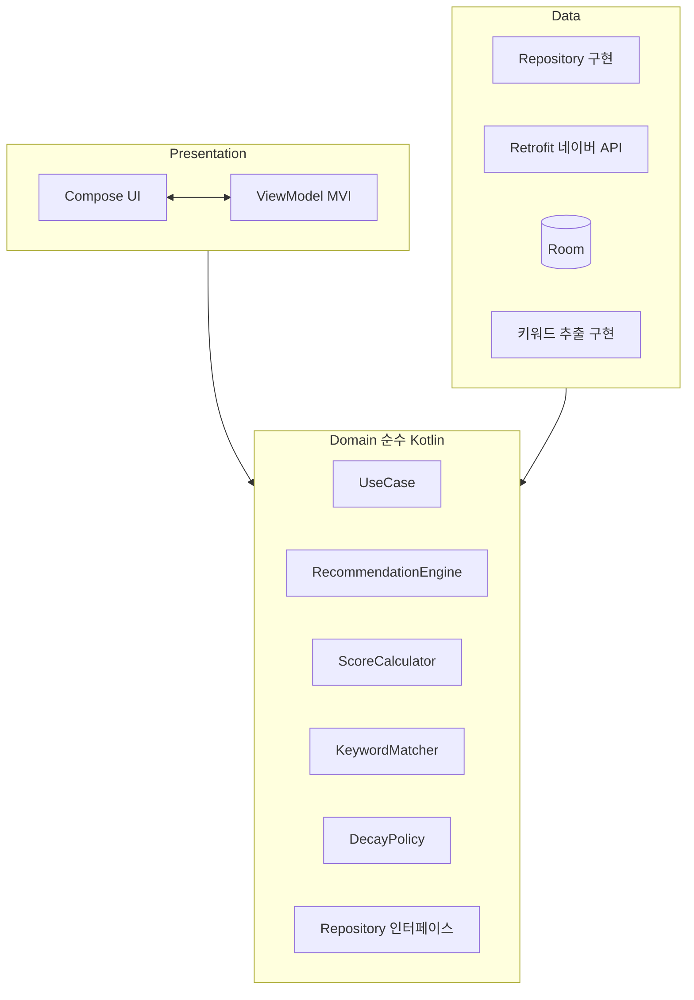
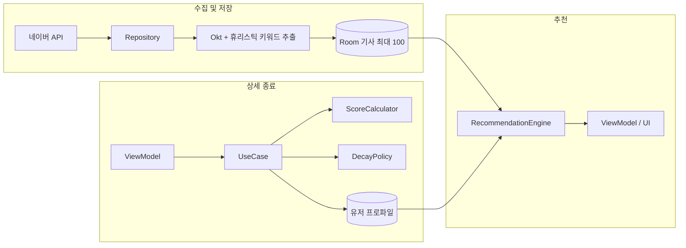

# SmartNews — AI 에이전트 가이드

이 문서는 **코딩 에이전트**가 이 저장소에서 작업할 때 따라야 할 맥락, 구조, 규칙을 한국어로 정리합니다.  
사람이 읽는 상세 스펙은 [README.md](README.md)를 기준으로 하되, 아래 **MVP 키워드 추출** 방향을 함께 참고합니다.

**MVP 키워드 추출 (톤)**  
MVP 단계에서는 **온디바이스 제약**과 **복잡도**를 고려해, **형태소 분석(Okt)** 을 활용하되 **별도의 ML 모델 없이**, **휴리스틱**으로 키워드를 고르고 자릅니다.  
즉, Okt로 후보(예: 명사)를 얻고 — 상한·불용어·제목/설명 비중·점수 규칙 등은 **규칙 기반**으로 결정합니다.

---

## 1. 프로젝트 한 줄 요약

- **온디바이스** 뉴스 추천 Android 앱. **추천 백엔드 없음.**
- 네이버 뉴스 API로 기사를 가져오고, **Room + Flow**로 로컬 상태를 유지합니다.
- 개인화는 **키워드 프로파일** + **클릭·체류·스크롤** 신호로 계산합니다.

---

## 2. 아키텍처 (Clean Architecture)

- **Clean Architecture** 동심원 구조: **Domain**(최내곽) ← Presentation, Data(외곽).
- **비즈니스 로직(추천·점수·감쇠·매칭)**은 **Domain**에만 둡니다. Android Framework / Room / Retrofit에 **Domain이 직접 의존하지 않게** 합니다.
- **MVP**에서는 UseCase를 **얇게** 유지하고, 복잡한 알고리즘은 Domain의 `RecommendationEngine`, `ScoreCalculator`, `DecayPolicy`, `KeywordMatcher` 등으로 쪼갭니다.

### 2.1 전체 구조 (Mermaid)



### 2.2 의존성 방향 (Dependency Rule)

- **Presentation** → Domain(UseCase, Repository 인터페이스). ViewModel은 UseCase를 통해 Domain에 접근.
- **Data** → Domain 인터페이스를 **구현**. Repository 구현체, DTO↔Domain 매핑은 Data에 둠.
- **Domain** → 외부 의존 없음 (최내곽). 순수 Kotlin만.

역방향( Domain → Android SDK / Data 구현체 직접 참조 등 )은 **금지**입니다.

---

## 3. UseCase를 쓰는 이유

1. **역할 분리**: ViewModel은 UI 상태·이벤트(MVI)에 집중하고, “뉴스 불러와서 저장하고 추천 갱신” 같은 **작업 순서**만 UseCase에 둡니다.  
2. **테스트**: UseCase는 코루틴/Flow 입출력을 **시나리오 단위**로 단위 테스트하기 쉽습니다.  
3. **중복 방지**: 같은 흐름(예: 상세 종료 후 프로파일 갱신 + 추천 재계산)을 여러 화면에서 호출할 때 **한 곳**에 모읍니다.  
4. **Domain 보호**: 무거운 계산은 Domain으로만 보내고, UseCase에는 **호출 순서·트랜잭션 경계**만 두어 “God ViewModel”을 막습니다.

**주의**: UseCase 안에 추천 공식·키워드 매칭 로직을 **길게 쓰지 말 것**. 그 코드는 Domain으로 옮깁니다.

---

## 4. 데이터 흐름 (Mermaid)



---

## 5. 도메인 컴포넌트 책임 (요약)

| 컴포넌트 | 책임 |
|----------|------|
| `RecommendationEngine` | 20개 슬롯, 70% 개인화 / 30% 탐색, 데이터 부족 시 랜덤 등 |
| `ScoreCalculator` | `click + dwell + scroll` 가중, 키워드에 `score/N` 분배 |
| `DecayPolicy` | `score *= pow(0.9, days)` 등 시간 감쇠 |
| `KeywordMatcher` | 기사 키워드와 유저 키워드 매칭(필요 시 부분 일치 규칙은 여기서 정의) |

---

## 6. 키워드 추출 (MVP: Okt + 휴리스틱, 비-ML)

MVP에서는 **온디바이스 부담**과 **유지보수 복잡도**를 줄이기 위해 다음을 기본으로 합니다.

- **형태소 분석(Okt)** 으로 한국어 **명사·구 등 후보**를 얻는다. (문장을 단순 split만 하지 않는다.)
- **별도의 ML 모델**(임베딩, 랭커 NN 등)은 쓰지 않는다.
- 후보 중 최종 키워드는 **휴리스틱**으로 결정한다: 불용어, 길이(≥2), 빈도·위치 가중, **제목 2 + 설명 2~3** 비율, **최대 5개** 상한 등.

**입력**: 제목 + 설명(요약) 텍스트.  
**구현 메모** (상수·룰은 `data/keyword` 등 한곳에 모음):

- Okt 출력을 받아 **정규화**(공백·대소문자·노이즈) 후 불용어 제거
- 숫자·URL 위주 토큰 제거
- 제목·설명 각각에서 상위 후보를 뽑아 **합치고**, 전역 상한·비율 규칙 적용
- **저장 시점에만** 추출해 DB에 넣고, **추천할 때마다 전 문서 재분석하지 않음**

Okt 연동은 **백그라운드 스레드**에서 수행하고, **Domain**은 “키워드 추출”을 **인터페이스**로 두어 구현체(Okt 파이프라인)를 **Data** 레이어(`data/keyword`)에 둔다.

---

## 7. 사용자 신호·재계산

- **클릭**, **체류(dwell, 포그라운드·상한)**, **스크롤 70% 이상**을 로그로 남깁니다.
- 추천 **재계산**: 앱 실행, 사용자 새로고침, **상세 화면 종료 후**(프로파일 반영 이후).

---

## 8. 에이전트 작업 시 체크리스트

- [ ] Domain에 Android `Context`, Room Entity 직접 의존 없음 (순수 Kotlin)
- [ ] Data/Presentation은 Domain **인터페이스**에만 의존 (Dependency Rule)
- [ ] 추천·감쇠·키워드 매칭 로직이 ViewModel/Fragment에만 있지 않음  
- [ ] 키워드 추출은 **Okt(형태소) + 휴리스틱**, **비-ML**, 저장 시 1회  
- [ ] 페이징은 **단일 스트림**으로 일관성 유지  
- [ ] README와 코드·스펙이 어긋나면 **문서 또는 코드**를 함께 수정  

---

## 9. 패키지 루트

`com.djyoo.smartnews` — `di` (DI 설정) / `domain` (최내곽) / `data` (외곽, 구현체·키워드 추출·유틸) / `presentation` (외곽, UI).

---

# 10. 코딩 패턴 규칙 (Coding Patterns)

이 섹션은 코드 스타일이 아니라 **의도와 안정성을 강제하는 규칙**이다.  
에이전트는 아래 규칙을 기본값으로 따른다.

---

## 10.1 컬렉션 사용 규칙

### Prefer
- 기본적으로 `mutableMapOf()` 사용
- 순서 보장이 필요 없는 경우 가장 단순한 컬렉션 선택
- 자료구조 선택이 의도를 드러내도록 작성

### Avoid
- 순서 보장이 필요 없는데 `linkedMapOf()` 사용 금지
- 불필요하게 의미를 가지는 컬렉션 선택 금지

### Rationale
- `linkedMapOf()`는 삽입 순서 보장이라는 의미를 가진다
- 실제 요구사항이 없는데 사용하면 잘못된 의도를 암시한다

---

## 10.2 테스트 작성 규칙

### Prefer
- `expected` / `actual`을 명확히 생성 후 전체 객체 비교
- 테스트는 결과 구조 전체를 검증
- 테스트 이름은 행동 기반 (given/when/then 또는 행위 중심)

### Avoid
- 특정 필드만 부분 비교하는 테스트 금지 (가능한 경우)
- 여러 assert로 분산된 테스트 금지
- 구현 세부사항에 의존하는 테스트 금지

### Rationale
- 부분 비교는 필드 추가/변경 시 회귀 버그를 놓칠 가능성이 높다
- 전체 비교는 테스트 의도를 명확하게 하고 유지보수에 강하다

### Example

```kotlin
// Preferred
val expected = UserProfile(
    id = 1,
    score = 10.0
)

val actual = result
assertEquals(expected, actual)

// Avoid
assertThat(result.id).isEqualTo(1)
assertThat(result.score).isEqualTo(10.0)
```

---

## 10.3 함수 설계 규칙
### Prefer
- 함수는 하나의 책임만 가지도록 분리
- 조건 분기는 early return으로 단순화
- null 처리 로직은 입구에서 정리

### Avoid
- 하나의 함수에서 여러 역할 수행 금지
- 깊은 중첩 if 구조 금지
- boolean 파라미터로 분기 제어 금지

### Rationale
- 복잡한 분기 구조는 테스트와 유지보수를 어렵게 만든다
- early return은 가독성과 안정성을 높인다

---

## 10.4 코드 의도 표현 규칙
### Prefer
- 타입과 함수 이름으로 의도를 드러낼 것
- 값의 의미를 변수명에 포함
### Avoid
- 의미 없는 이름 (data, value, result) 남용 금지
- 의도를 숨기는 축약형 이름 금지

---
*이 파일은 저장소 작업용 에이전트 지침이며, README의 사용자 향 설명을 대체하지 않습니다.*
