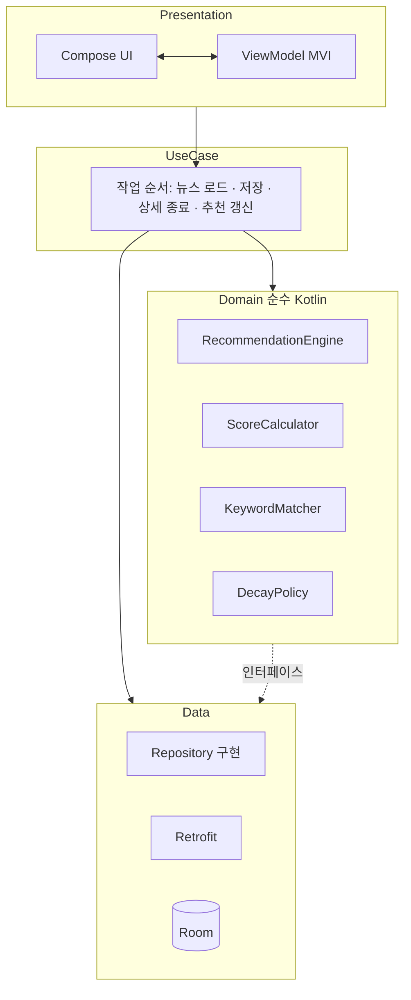
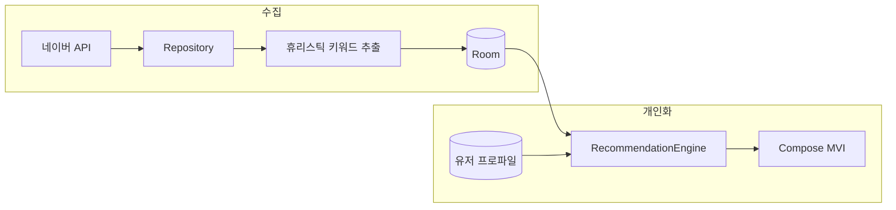

# 온디바이스 뉴스 추천 (On-Device News Recommendation)

백엔드 **추천 서버 없이** 뉴스를 추천하는 Android 앱입니다.  
개인화·프로파일, 점수, 감쇠(decay), 랭킹은 **전부 디바이스 로컬**에서 계산합니다.

---

## 프로젝트 개요

| | |
|---|---|
| **개인화 방식** | 사용자 행동(클릭·체류·스크롤) 기반 **키워드** 프로파일 |
| **데이터 소스** | [네이버 뉴스 API](https://developers.naver.com/docs/serviceapi/search/news/news.md) |
| **로컬 스택** | Room, Kotlin Coroutines / **Flow**, Jetpack Compose |

---

## 핵심 요구사항

### API

- **네이버 뉴스 API**로 뉴스 수집
- **단일 broad 쿼리** (예: `"뉴스"`) — API 응답에 **카테고리 필드 없음**
- 최초 로드 시 날짜 기준 **최신 100건**
- **offset 기반** 무한 스크롤(페이징)
- 페이지 결과를 **단일 스트림**으로 유지해 중복·불일치 방지

### 저장

- 기사 **최대 100개** 유지, **최신순** (초과 시 오래된 항목 제거)
- 키워드는 **추천 시점이 아니라 저장 시점**에 추출·저장
- 원문: **제목(title) + 요약(description)**
- **휴리스틱(규칙 기반)** 으로 토큰화·정규화 (형태소 분석기 의존 없이, 길이·불용어·제목/설명 비중 등으로 추출)
- 기사당 키워드 **최대 5개**, 분배: **제목 2개 + 설명 2~3개**

### 유저 프로파일

- **`(keyword, score)`** 형태로 저장
- **Top-K (최대 20개)** 유지
- 순위만이 아니라 **임계값(threshold)** 으로 저점수 키워드 제거

### 사용자 인터랙션

| 신호 | 설명 |
|------|------|
| **Click** | 상세 화면 진입 |
| **Dwell time** | **포그라운드만** 측정, **상한(capped)** 으로 이상치 완화 |
| **Scroll** | 콘텐츠 **70% 이상** 스크롤 시 의미 있는 읽기로 간주 |

### 점수

- `score = click + dwell + scroll` (가중치는 domain에서 설정)
- 기사 키워드에 **균등 분배**: 각 키워드에 `score / N` (N = 해당 업데이트에 사용한 키워드 수)
- 저장된 키워드 점수에 **시간 기반 감쇠**

  `score *= pow(0.9, days)`

### 추천

- 총 **20**개
- **70%** 개인화 (키워드 겹침 / 유저 키워드 점수)
- **30%** 탐색(**랜덤**)
- 개인화가 약할 때 **Fallback** : 랜덤

### 재계산 시점

- **앱 실행**
- **사용자 새로고침**(버튼 혹은 당겨서 새로고침 등)
- **상세 화면 종료 후** (인터랙션 반영·프로파일 갱신 이후)

### 키워드 추출 규칙 (휴리스틱)

- 길이 **≥ 2**, **불용어** 제거, 토큰 **정규화**
- **제목·설명**에서 각각 상위 후보를 뽑아 **제목 2 + 설명 2~3** 비율로 합침 (총 최대 5개)
- 형태소 분석기 없이 규칙·빈도·위치 가중 등으로 구현 (필요 시 나중에 NLP 모듈로 교체 가능)

---

## 아키텍처

3-tier 구조를 기반으로 Domain 계층에 비즈니스 로직을 분리하여  
플랫폼 및 데이터 구현으로부터의 독립성을 유지했습니다.  

초기 MVP(Minimum Viable Product) 단계에서는 UseCase 계층을 최소화하고,  
추천 로직을 Domain에 집중해 이후 확장을 고려한 구조로 설계했습니다.

| 레이어 | 역할                                             |
|--------|------------------------------------------------|
| **Presentation (MVI)** | 단일 상태, 이벤트 → 의도 Compose UI                     |
| **Domain** | 순수 Kotlin: 엔진, 정책, 계산기 (**Android import 없음**) |
| **Data** | Room, Retrofit, Repository 구현체                 |

### 스택 요약

- **MVI**: 목록, 상세, 추천 영역의 상태를 예측 가능하게
- **UseCase**: **필요한 순서로 Repository·Domain만 호출** — **무거운 계산은 Domain에 둠**
- **Kotlin Flow**: DB, UI 스트림
- **Domain**이 추천 규칙의 중심, **Data**는 저장, 네트워크만

### 구조 다이어그램 (Mermaid)

의존성은 **위 → 아래** 한 방향입니다.  
`Presentation → UseCase → Domain → Data` (역방향 의존 없음).



- **UseCase**: 호출 순서만 맞추고, **실제 계산은 Domain**에 둠 (에이전트·협업 규칙은 [AGENTS.md](AGENTS.md) 참고).

### 도메인 구성 (책임 분리)

| 컴포넌트 | 역할 |
|----------|------|
| **RecommendationEngine** | 20개 슬롯(70/30), 부족 시 랜덤으로 보충 |
| **ScoreCalculator** | 인터랙션 → 수치 점수, 키워드별 분배 |
| **DecayPolicy** | `pow(0.9, days)` (또는 설정 가능한 밑) |
| **KeywordMatcher** | 기사·유저 키워드 매칭으로 개인화 점수 계산 (규칙은 Domain에서 정의) |

**UseCase**는 Repository와 위 컴포넌트를 **순서대로 호출만** 하고, 알고리즘은 Domain에만 두어 **같은 로직을 두 번 쓰지 않음**.

---

## 데이터 흐름

1. **수집** — API → DTO 매핑 → 도메인 모델 → **저장** → 저장 시 **휴리스틱** 키워드 추출 → 최대 5개 (제목 2 + 설명 2~3).
2. **목록** — DB(≤100)와 페이징 커서를 **단일 Flow**로 합쳐 UI에 일관된 스트림 제공.
3. **상세** — 시작 시각 기록 종료 시 dwell(포그라운드·상한), 스크롤 70% 이상 반영, **인터랙션** 저장, 프로파일 **decay** 후 키워드에 `score/N` 반영, **Top-K + threshold** 정리.
4. **추천** — 실행/새로고침/상세 종료 시 **RecommendationEngine** 실행 → 개인화+탐색 슬롯 → 부족 시 **랜덤** 보충.



---

## 주요 설계 결정

- **저장 시 키워드 추출** — 추천 연산을 가볍게, 기사 특징은 DB가 단일 진실 공급원
- **MVI** — 목록·상세·추천 패널 상태 추론이 쉬움
- **무거운 로직은 domain 클래스**, UseCase는 얇게 유지해 테스트·모킹 용이
- **단일 페이징 스트림** — 캐시와 네트워크 페이지 간 레이스 완화
- **decay는 domain 정책** — 동일 공식으로 일관 적용, `0.9`·`days` 정의 튜닝 용이
- **개인화가 약할 때 Fallback** — 랜덤으로 채워 콜드 스타트·희소 프로파일에서도 동작

---

## 성능 고려사항

- 키워드 추출은 **기사당 1회**(삽입/갱신 시), 추천할 때마다 전부 돌리지 않음
- **Flow** + Room **Paging**(또는 수동 offset), 필요 시 **distinctUntilChanged** 로 불필요한 UI 갱신 감소
- **dwell 상한**으로 백그라운드·방치 탭에 의한 왜곡 완화
- **Top-K + threshold**로 메모리·쿼리 크기 상한 (프로파일 키워드 ≤20)
- 키워드 휴리스틱도 **메인 스레드 비사용**; 저사양 기기에서는 배치·캐시 검토

---

## 패키지 구조 (예상)

```
com.djyoo.smartnews
├── presentation/     # MVI, Compose
├── domain/
│   ├── engine/
│   ├── scorer/
│   ├── policy/
│   ├── matcher/
│   └── usecase/      # 호출 순서만 (계산은 Domain)
└── data/             # remote, local, repository 구현
```

---

## 기술 스택 요약

- Kotlin · Jetpack Compose · Coroutines · **Flow**
- Room · Retrofit · OkHttp
- Hilt · MVI (직접 구현 또는 라이브러리 무관)
- 키워드 **휴리스틱** (규칙·불용어·빈도 등) — 저장 시 1회 추출

---

## 라이선스

*이 프로젝트는 개인 학습 및 포트폴리오 목적으로 제작되었습니다.*
